#    基于百度云的可燃气体监测仪

传统的可燃气体监测仪为单机设备，只能检测一定区域的范围并在此范围内发出警报，在一般情况能够达到火灾报警的需要。但在一些夜间无人值守的区域如仓库、变电站、商场、燃气管道等，单机的设备即使发出警报也不能及时传达到人们手中，等人们发觉时往往已经造成了不可挽回的损失。针对这种情况，传统的报警器已经不再适用，需要能够接入网络并实时监测且能够及时发送报警信息至安全员手中的新一代设备，下面我们将开启新一代设备的开发实现之路，请看后续内容。

本案例基于百度云物接入功能实现，开发者需要注册百度云并开通物接入服务，关于百度云物接入服务后续有详细介绍。

## 代码说明

| 目录       | 说明                                       |
| -------- | ---------------------------------------- |
| TiJOSApp | TiJOS应用源码, 通过Eclipse(Ti-Dev Studio)打开, 可运行于TiKit开发板 |
| Android  | 对应的Android应用源码, 可通过AndroidStudio打开       |
|          |                                          |

## 硬件传感器

| 名称            | 功能      |
| ------------- | ------- |
| ESP-8266      | 核心开发板   |
| TiOLED_UG2864 | 显示屏     |
| TiRelay       | 继电器     |
| TiLED         | LED灯    |
| TiMQ2         | 温湿度计    |
| TiDHT         | 可燃气体感应器 |
| TiButton      | 按键      |
| TiBuzzer      | 蜂鸣器     |

上面列表为开发中所用到的硬件传感器部分，请参照文档《GasMonitoring可燃气体监测仪例程》中的描述连接好开发板上的传感器，请确保连接正确，避免出现短路损坏开发板或传感器。

## 架构

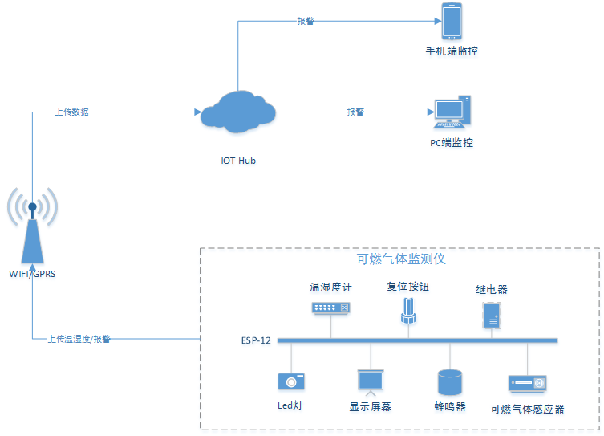

新一代设备可通过Wifi或GPRS接入互联网，实时上传当前温湿度和报警数据。ESP-8266支持Wifi快速接入，如需GPRS接入可外加模块。

## 功能介绍

通过架构图我们可以看到整个架构分为三大部分，硬件设备、IOT Hub、监控端。硬件设备部分基于ESP-8266开发板开发并连接温湿度计、复位按钮、继电器、Led灯、显示屏幕、蜂鸣器、可燃气体感应器等外设。ESP-8266自带Wifi模块可接入无线网络，能够满足联网需求。在工作状态下ESP-8266通过可燃气体感应器监测周围环境，当监测到可燃气体时ESP-8266会收到监测事件，控制蜂鸣器发出声音以及Led灯闪烁并切断继电器电源。同时在联网情况下通过Wifi向云端IOT Hub发送警报信息，由IOT Hub将警报通知到相关人员手中。在警报解除前如果按下复位按钮则关闭蜂鸣器，但Led灯和继电器以及可燃气体感应器仍然为警报状态，这种状态会一直持续到警报解除才会复位。温湿度计实时采集当前环境数据并显示在屏幕外设上，在联网状态下会每10秒向IOT Hub发送一次，方便相关人员了解当前的实时温湿度。IOT Hub部分使用百度云的物接入功能，基于MQTT协议可以方便快捷的传输数据。物接入中有相关的设备管理、密钥管理和访问规则控制等功能，能够很好的维护设备的关联关系。监控端部分分为手机端监控和PC端监控，手机端适合人员在不固定的场景情况下随时接收警报信息，PC端适合有固定的场景如监控室或中心实时监测环境。

## 开通百度云

首先访问百度云官网注册账户并进入管理控制台，在百度云管理控制台中开通物接入服务（注：使用百度云下的服务需要对账户进行实名认证，请自行参考官方说明进行实名认证）。物接入服务成功开通后进入物接入控制台创建实例，实例名称任意，此处取名GAS，创建成功后点击实例名称进入实例控制台并在实例控制台下创建设备、身份、策略等操作。实例下会自动生成三个broker地址，可通过不同的协议连接对应的地址。

tcp://gas.mqtt.iot.bj.baidubce.com:1883

ssl://gas.mqtt.iot.bj.baidubce.com:1884

wss://gas.mqtt.iot.bj.baidubce.com:8884

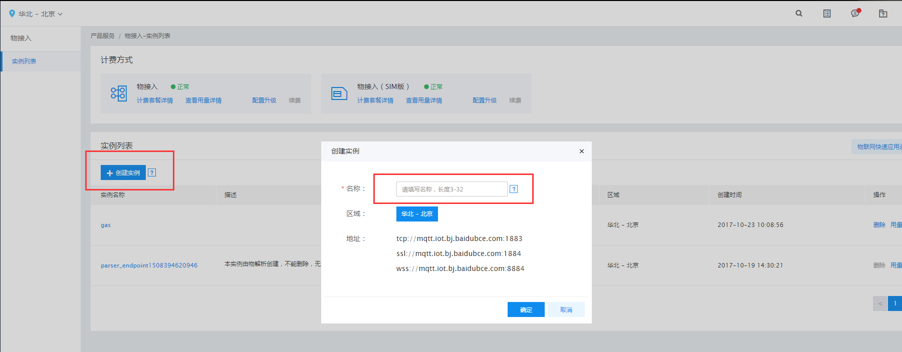

- 创建策略

首先创建策略，即为设备分配相应的Topic以及设置相关权限，此处创建两个策略分别为gas、admin，策略主题如下。

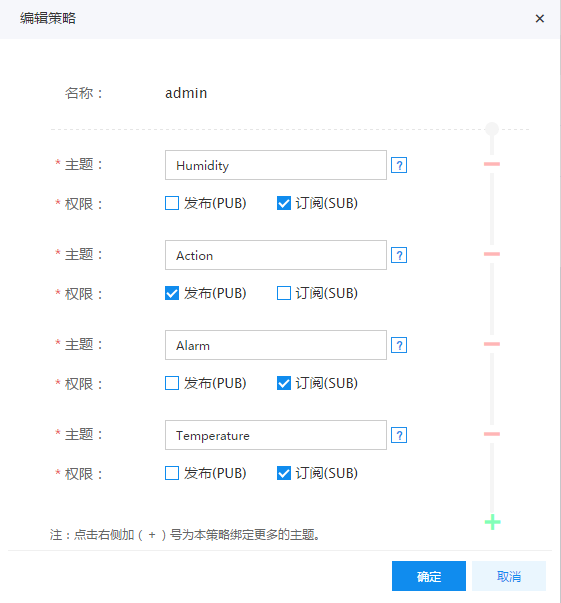

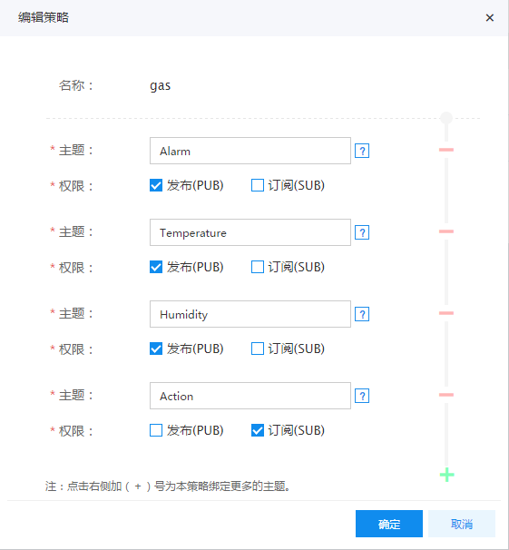

- 创建身份

其次创建身份：1.创建身份，输入名称，由于是为设备创建授权，名称建议与硬件设备名称一致。2.设置策略，选择前面创建的策略gas即可。3.确认信息，保存好密钥信息，设备连接需要验证密钥。

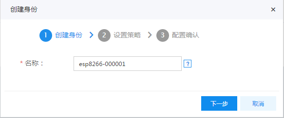

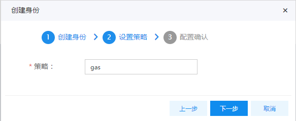

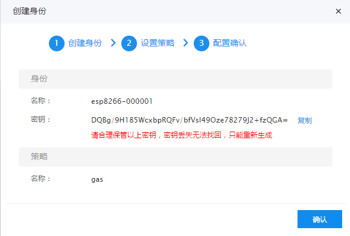

在创建完设备esp8266-000001身份后继续创建设备admin的身份，策略选择admin即可。

- 创建TIJOS设备

继续创建设备：1.创建设备，输入的名称与硬件中获取的设备名称保持一致，假设此处为esp8266-000001。2.设置身份，选择esp8266-000001即可。3.设置策略，点击确认即可。

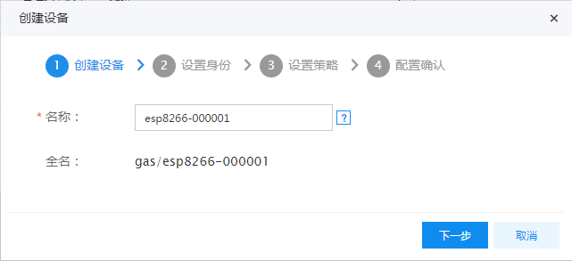

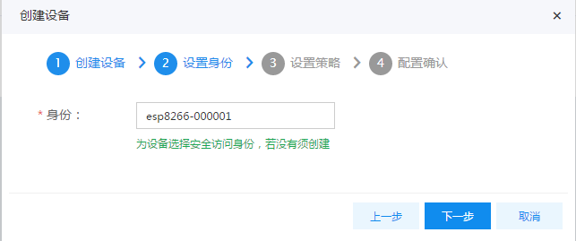

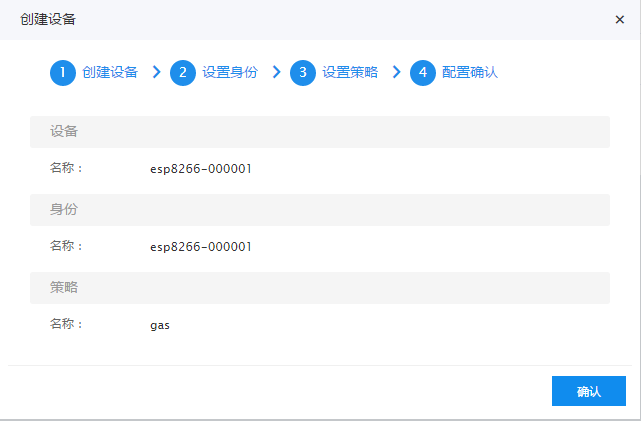

- 创建Admin设备

下面将创建admin设备，admin设备是手机端管理和接收报警信息角色。创建过程同TIJOS设备创建一样，名称为admin，身份选择admin即可。

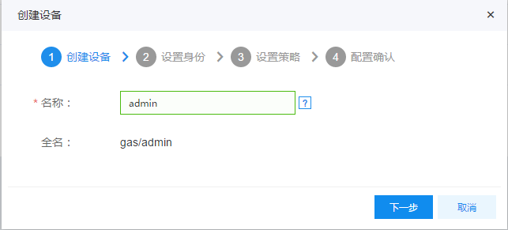

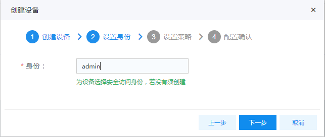

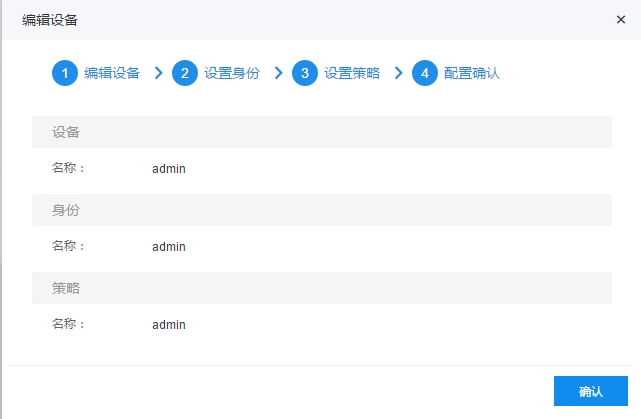

至此百度云配置完毕，下面将转入源码进行编译。

## 代码编译

从GitHub下载已完成的代码，通过Ti-Dev Studio导入到Workspace中（注：Ti-Dev Studio工具的安装请参考文档《Ti-Dev Studio用户手册》）。在Ti-Dev Studio中可以看到工程基于TiJOS Framework开发，所有源码和API都是Java代码，依托于Java的跨平台特性，我们可以将代码运行在任何硬件平台上。TiJOS Framework对各种外设传感器做了抽象封装，通过API可方便快捷的操作外设硬件。下面将修改工程源码进行上线前调试。

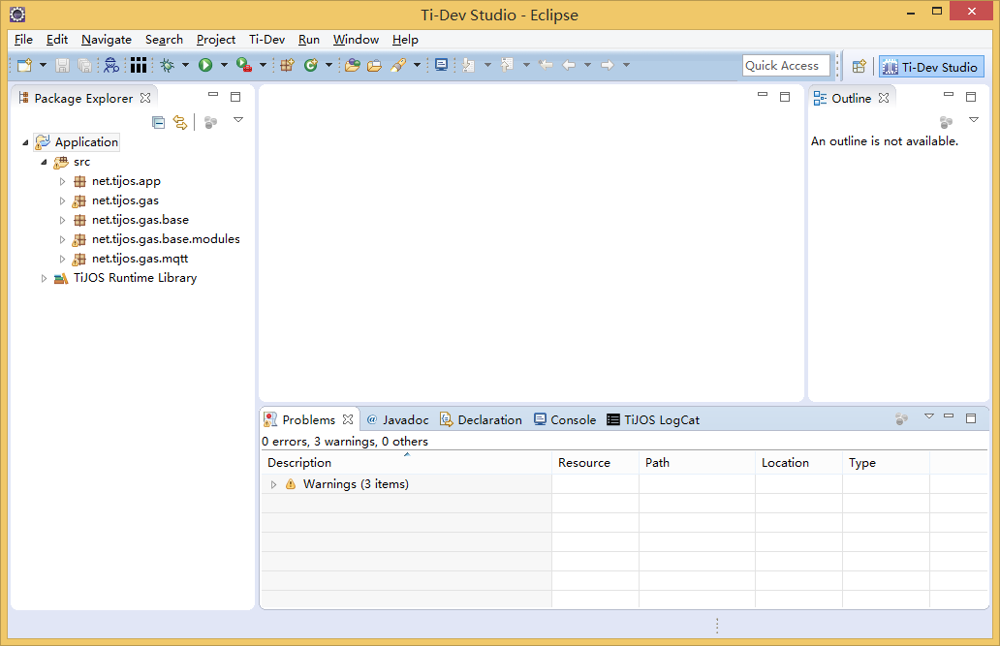

转到包net.tijos.gas.mqtt下找到BaiduMqttService类，BaiduMqttService类包含基于MQTT协议的接入百度云的代码，在代码前面部分有与连接相关的常量参数，分别对应设备名称、broker地址、用户名、用户密码。将参数修改为我们前面百度云物接入配置对应的数据，然后保存。接着将修改后的代码下载至设备中，下载步骤选中工程右键弹出菜单点击Run as --> TiJOS Application实时下载至硬件中。

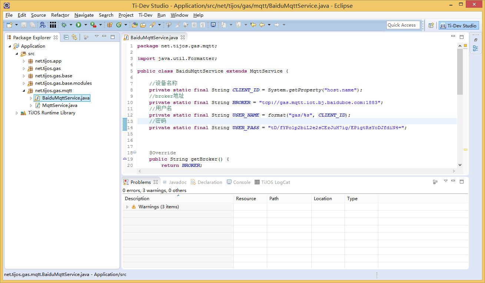

代码中的数据修改完后转入Ti-Device Manager工具下，Ti-Device Manager能够自动检测COM端口识别硬件。在Ti-Device Manager点击刷新后选中设备，然后点击工具栏设备属性按钮，切换到WLAN页面下进行配置。WLAN页面下的信息为Wifi连接配置信息，请输入正确的配置信息确保硬件在上电后能够自动连接Wifi接入网络。

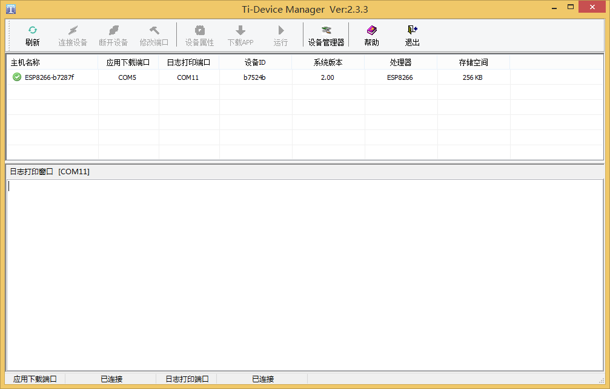

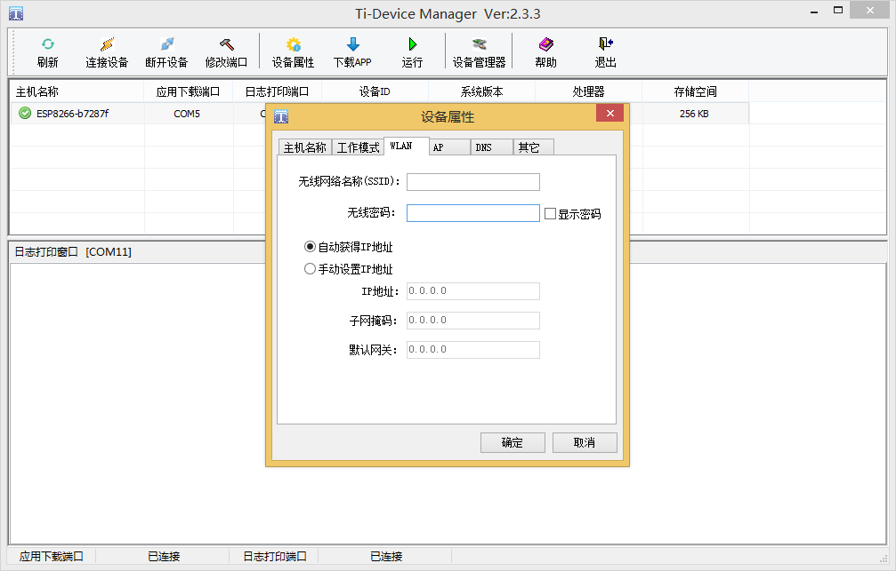

## 手机端监控

手机端监控基于Android平台开发，从GitHub下载手机端监控代码，使用Android Studio导入。在Android Studio中我们可以看到监控端的工程信息和代码，代码不用修改即可直接编译使用，通过Android Studio直接安装至手机端并运行。运行后进入登录界面，提示输入broker地址以及用户名和密码，此处信息输入在百度云物接入中创建的admin用户和密钥然后登录。成功登录后跳转到监控台，可以看到当前实时的状态以及温湿度等信息，当收到警报是监控台会立刻发出声音和震动通知使用者。监控台中有静音按钮，与设备上复位按钮作用相同，用于发生警报时关闭设备蜂鸣器声音。

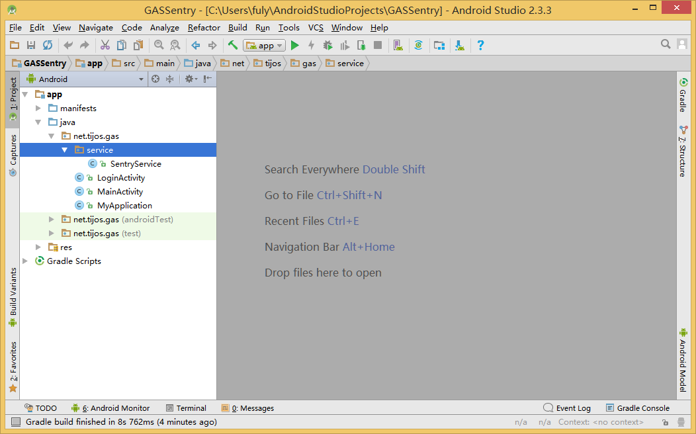

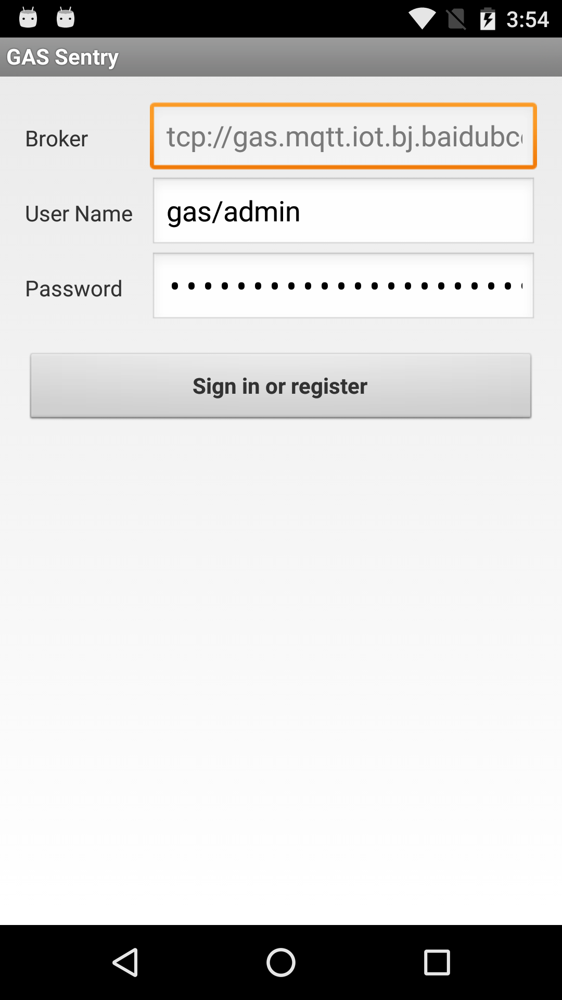

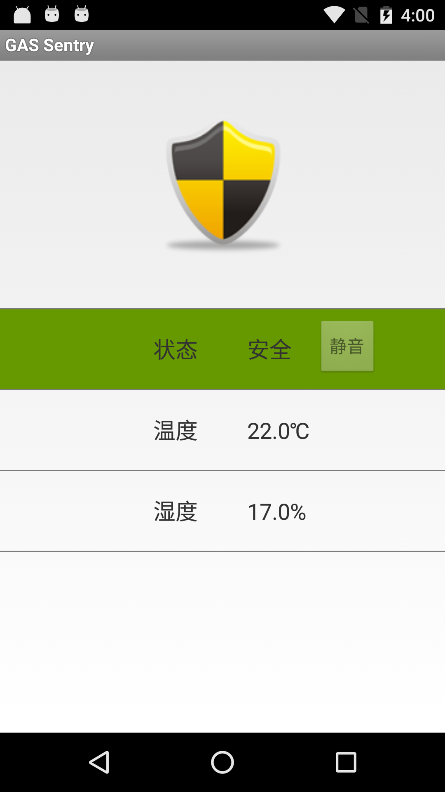

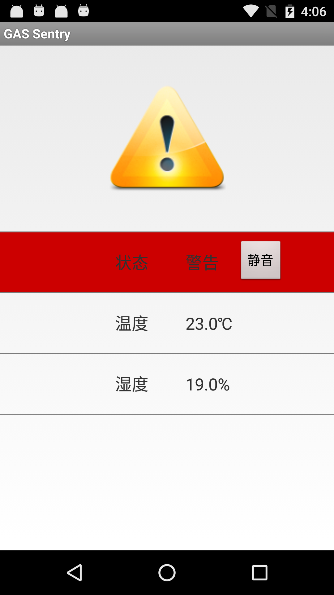

## 总结

至此，基于物联网的新一代可燃气体监测仪的开发设计介绍完毕，按照此方案设计出来的产品已达到火灾警报，温湿度监测以及数据实时处理等功能需求。在实际应用中，如要对硬件扩展功能，只需购买相应的外设接入硬件，在代码中调用相关api即可，详细介绍请观看TiJOS相关教程，
